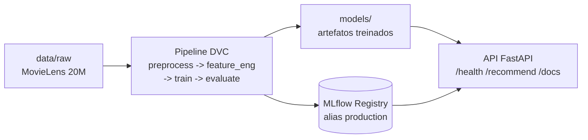

# fiap-mlet-challenge-fase-2

Sistema de recomendação de filmes baseado no comportamento de avaliação dos usuários
(MovieLens 20M). O modelo central é uma rede neural de fatoração de matrizes treinada com
BPR (Bayesian Personalized Ranking) em PyTorch, comparada a baselines scikit-learn. O
fluxo é versionado com DVC, rastreado no MLflow (DagsHub), servido por uma API FastAPI e
containerizado com Docker.



Para os detalhes de arquitetura, pipeline e do modelo, veja a
[Documentação](#documentação).

## Documentação

- [Arquitetura](docs/ARCHITECTURE.md): estrutura do pacote, fluxo do pipeline DVC, design
  patterns, MLflow/Registry e camada de serving.
- [Model Card](docs/MODEL_CARD.md): modelo BPR-MF, dados, hiperparâmetros, métricas,
  comparação com baselines, limitações e vieses.
- [Diretrizes de código](docs/CODE_GUIDELINES.md): clean code, SOLID, design patterns,
  ruff e estrutura de diretórios.
- [Guia de contribuição](docs/CONTRIBUTING.md): setup, convenções de Git e validação.

## Gates de commit

Este projeto possui validações automatizadas para manter a rastreabilidade do
histórico Git. As validações rodam localmente via `make` e também no GitHub
Actions em pushes e pull requests.

Os gates validam:

- **Commits**: devem seguir a especificação de
  [Conventional Commits 1.0.0](https://www.conventionalcommits.org/en/v1.0.0/#specification).
- **Branches**: devem seguir a especificação de
  [Conventional Branch 1.0.0](https://conventional-branch.github.io/#specification).
- **Tags**: devem usar versionamento semântico no formato `MAJOR.MINOR.PATCH`,
  por exemplo `1.0.0`, `1.2.3` ou `2.0.0`.

## Instalação

Este projeto usa `uv` para gerenciar dependências.

```bash
make install
```

O comando instala as dependências do projeto e as ferramentas de desenvolvimento,
incluindo `commitizen`, usado para validar as mensagens de commit.

### Por que uv (e não Poetry)

O projeto usa [`uv`](https://docs.astral.sh/uv/) como gerenciador de dependências,
equivalente moderno ao Poetry para fins de reprodutibilidade:

- `pyproject.toml` no padrão PEP 621 (deps de prod + grupo `dev`);
- `uv.lock` versionado, fixando todas as versões transitivas;
- instalação determinística via `uv sync --all-groups` (exposta como `make install`,
  o análogo de `poetry install`).

### Configuração do ambiente

Copie o `.env.example` e preencha as credenciais DagsHub (necessárias para treino e
tracking no MLflow):

```bash
cp .env.example .env   # depois edite DAGSHUB_TOKEN / DAGSHUB_USER
```

Valide o ambiente (versão do Python, deps críticas, `.env` e acesso ao dataset):

```bash
make validate-env
```

## Docker

Imagem multi-stage (builder `uv` + runtime slim, usuário não-root):

```bash
make docker-build                    # constrói a imagem recsys:local
docker compose up mlflow             # UI do MLflow em http://localhost:5000
make docker-train                    # roda o pipeline (preprocess→…→evaluate) no container
```

`docker compose run --rm train` requer o `.env` (DagsHub) e o `data/raw` presente no host
(monta `./data` e `./models` como volumes). O serviço `mlflow` sobe um servidor local com
backend sqlite; o treino loga no MLflow do DagsHub, salvo se `MLFLOW_TRACKING_URI` for
sobrescrito.

## API (FastAPI)

Expõe o modelo final. Requer o pipeline treinado (`models/bpr.pkl` + `models/serving.pkl`).
Carrega o modelo do Model Registry (alias `production`) quando há credenciais DagsHub, com
fallback para o pickle local.

```bash
make api                             # uvicorn em http://localhost:8000 (ou: docker compose up api)
curl -i localhost:8000/health        # {"status":"ok",...} + headers X-Request-ID / X-Process-Time
curl "localhost:8000/recommend?user_id=1"   # top-10 por score (404 se o user não existe)
# Swagger: http://localhost:8000/docs
```

## Como executar as validações

Para executar todos os gates:

```bash
make validate
```

Para listar todos os comandos disponíveis:

```bash
make help
```

Validações individuais:

```bash
make validate-branch
make validate-commits
make validate-tags
```

Também é possível sobrescrever os valores usados pelas validações:

```bash
make validate-branch BRANCH=feat/adicionar-pipeline
make validate-commits COMMITS_RANGE=origin/main..HEAD
make validate-tags TAGS="1.0.0 1.1.0"
```

## Hooks locais

Os hooks locais são opcionais. Eles só passam a executar automaticamente depois
que o usuário habilitar explicitamente:

```bash
make install-hooks
```

Esse comando configura o repositório para usar os hooks versionados em
`.githooks/`.

Hooks disponíveis:

- `pre-commit`: valida o nome da branch atual;
- `commit-msg`: valida a mensagem do commit com Conventional Commits;
- `pre-push`: valida branch, commits enviados e tags enviadas.

Para desabilitar os hooks locais:

```bash
make uninstall-hooks
```

## Padrões aceitos

Exemplos de commits válidos:

```text
feat: add prediction endpoint
fix(api): handle empty payload
docs: update setup instructions
```

Exemplos de branches válidas:

```text
main
develop
feat/adicionar-pipeline
feature/issue-123-new-login
fix/corrigir-validacao
release/v1.2.0
```

Exemplos de tags válidas:

```text
0.1.0
1.0.0
2.3.4
```

## GitHub Actions

A pipeline está em `.github/workflows/validate-conventions.yml`.

Ela executa automaticamente:

- validação de branch em pushes e pull requests;
- validação das mensagens dos commits incluídos no push ou pull request;
- validação do nome da tag quando o evento for um push de tag.
