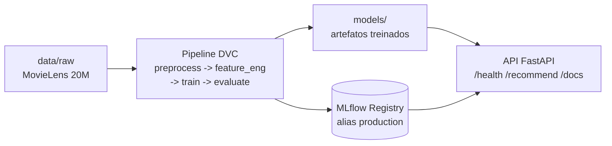

# fiap-mlet-challenge-fase-2 — Sistema de Recomendação

Sistema de recomendação de filmes baseado no comportamento de avaliação dos usuários
(MovieLens 20M). O modelo central é uma rede neural de fatoração de matrizes treinada com
BPR (Bayesian Personalized Ranking) em PyTorch, comparada a baselines scikit-learn. O
fluxo é versionado com DVC, rastreado no MLflow (DagsHub), servido por uma API FastAPI e
containerizado com Docker.


```mermaid
flowchart LR
    A[data/raw<br/>MovieLens 20M] --> B[Pipeline DVC<br/>preprocess -> feature_eng<br/>-> train -> evaluate]
    B --> C[models/<br/>artefatos treinados]
    B --> D[(MLflow Registry<br/>alias production)]
    C --> E[API FastAPI<br/>/health /recommend /docs]
    D --> E
```

## Links

- **MLflow (Registry + runs)**: <https://dagshub.com/JosueJNLui/fiap-mlet-challenge-fase-2.mlflow/> —
  experimentos rastreados e o modelo `MovieLens_BPR_Reco` promovido a `production`.

## Documentação

- [Arquitetura](docs/ARCHITECTURE.md): estrutura do pacote, fluxo do pipeline DVC, design
  patterns, MLflow/Registry e camada de serving.
- [Model Card](docs/MODEL_CARD.md): modelo BPR (NeuMF híbrido), dados, hiperparâmetros, métricas,
  comparação com baselines, limitações e vieses.
- [Diretrizes de código](docs/CODE_GUIDELINES.md): clean code, SOLID, design patterns,
  ruff e estrutura de diretórios.
- [Guia de contribuição](docs/CONTRIBUTING.md): setup, convenções de Git e validação.

## Como os critérios são atendidos

Mapa dos critérios de avaliação do challenge para onde eles vivem no repositório.

| Critério | Peso | Onde |
| -------- | ---- | ---- |
| Clean code e estrutura | 15% | `src/recsys/` modular; Factory (`models/factory.py`) + Strategy (`preprocessing/`); type hints + docstrings; ruff sem erros → [CODE_GUIDELINES](docs/CODE_GUIDELINES.md) |
| Reprodutibilidade | 15% | `uv.lock` versionado, `.env` + Pydantic Settings (`config.py`), seed 42 global, `make validate-env` |
| Docker | 15% | `Dockerfile` multi-stage (builder `uv` + runtime slim non-root), `docker-compose.yml` (train / mlflow / api) |
| DVC + Pipeline | 15% | `dvc.yaml` com 4 stages (preprocess → feature_eng → train → evaluate), remote no DagsHub, `dvc repro` |
| Rede neural (PyTorch) | 15% | BPR NeuMF híbrido com early stopping por NDCG@10, comparado a 4 baselines → [MODEL_CARD](docs/MODEL_CARD.md) |
| MLflow + Registry | 10% | 5 runs por execução rastreados, alias `staging` → `production` → [MLflow](https://dagshub.com/JosueJNLui/fiap-mlet-challenge-fase-2.mlflow/) |
| Vídeo STAR | 10% | — |
| Bônus: deploy em nuvem | 5% | — |

## Instalação

Este projeto usa `uv` para gerenciar dependências.

```bash
make install
```

O comando instala as dependências do projeto e as ferramentas de desenvolvimento,
incluindo `commitizen`, usado para validar as mensagens de commit.

### Por que uv (e não Poetry)

O projeto usa [`uv`](https://docs.astral.sh/uv/) como gerenciador de dependências,
equivalente moderno ao Poetry para fins de reprodutibilidade:

- `pyproject.toml` no padrão PEP 621 (deps de prod + grupo `dev`);
- `uv.lock` versionado, fixando todas as versões transitivas;
- instalação determinística via `uv sync --all-groups` (exposta como `make install`,
  o análogo de `poetry install`).

### Configuração do ambiente

Copie o `.env.example` e preencha as credenciais DagsHub (necessárias para treino e
tracking no MLflow):

```bash
cp .env.example .env   # depois edite DAGSHUB_TOKEN / DAGSHUB_USER
```

Valide o ambiente (versão do Python, deps críticas, `.env` e acesso ao dataset):

```bash
make validate-env
```

## Dados e pipeline (DVC)

O dataset raw (MovieLens 20M) é versionado com DVC, com remote no DagsHub. O pipeline
`dvc.yaml` tem 4 stages reproduzíveis por `dvc repro` (ou `make repro`):

```
preprocess   filtra/amostra/reindexa data/raw → data/processed/  (20.000 usuários, 13.088 itens)
feature_eng  split temporal treino/teste (leave-last 20% por usuário)
train        treina os 5 modelos, loga runs no MLflow, salva em models/
evaluate     agrega as métricas em comparison.csv + metrics.json
```

```bash
make data-pull       # baixa data/raw do remote DagsHub (requer creds)
make repro           # dvc repro — pipeline reproduzível de ponta a ponta
make pipeline        # equivalente sem DVC (preprocess → … → evaluate)
```

## Docker

Imagem multi-stage única (`recsys:local`), reutilizada pelos serviços do compose com
comandos diferentes — o pipeline e a API compartilham as mesmas dependências.

```bash
make docker-build    # constrói a imagem recsys:local
make docker-train    # roda o pipeline completo no container (requer .env + data/raw)
make docker-mlflow   # sobe a UI do MLflow em http://localhost:5000 (backend sqlite local)
make docker-api      # sobe a API em http://localhost:8000 (requer models/ treinado)
```

Os serviços montam `./data` e `./models` como volumes, então os artefatos gerados no
container persistem no host (e vice-versa). O treino loga no MLflow do DagsHub, salvo se
`MLFLOW_TRACKING_URI` for sobrescrito.

## API (FastAPI)

Expõe o modelo final. Carrega o modelo do Model Registry (alias `production`) quando há
credenciais DagsHub, com **fallback para o pickle local** `models/bpr.pkl`.

```bash
make api                                     # uvicorn local em http://localhost:8000
# ou: make docker-api                        # mesma API no container
curl -i localhost:8000/health               # {"status":"ok",...} + headers X-Request-ID / X-Process-Time
curl "localhost:8000/recommend?user_id=1"   # top-10 por score (404 se o user não existe)
# Swagger: http://localhost:8000/docs
```

### Importante: a API exige `models/` treinado e coerente com o código

A API depende de dois artefatos em `models/`, gerados pelo stage `train`:

- `models/serving.pkl` — mapeamentos id↔índice e itens já vistos por usuário (sem fallback);
- `models/bpr.pkl` — o modelo local, usado como fallback quando o Registry está indisponível
  (sem creds/rede) ou rejeita as credenciais.

Como o modelo é carregado no startup (readiness via `/health`), se algum artefato faltar
**ou** estiver desatualizado em relação ao código, o startup falha e `/health` responde
`503 {"status":"loading"}` — não é "carregando", é falha. O caso mais comum é um `bpr.pkl`
antigo, picklado contra uma classe que foi renomeada: o unpickle quebra com
`Can't get attribute '...' on module recsys.models.bpr`.

A correção é sempre **retreinar** para regenerar os pickles com o código atual:

```bash
make train           # regenera models/*.pkl (incl. bpr.pkl) + serving.pkl
# ou: make docker-train   (regenera pelo mesmo container que serve a API)
make api             # reinicia a API; /health volta a "ok"
```

## Modelo e resultados

Rede neural **BPR NeuMF híbrido** (GMF + MLP + termos de viés) em PyTorch, com early
stopping por NDCG@10 e negative sampling ponderado por popularidade. Comparada a 4 baselines
scikit-learn/NumPy no protocolo de catálogo completo (k = 10, positivos com nota ≥ 3,5,
NDCG com IC 95% sobre 500 usuários fixos). Valores de `comparison.csv`.

| Modelo | RMSE | NDCG@10 | Coverage |
| ------ | ---- | ------- | -------- |
| GlobalMean | 1,047 | 0,009 | 2,1% |
| Bias | **0,870** | 0,037 | 0,3% |
| SVD | 0,992 | **0,122** | 3,2% |
| Popularity | 1,738 | 0,069 | 0,6% |
| **BPR (neural)** | 1,268 | 0,117 | **5,5%** |

A rede NeuMF **empata estatisticamente com o SVD no ranking** (NDCG@10 0,117 vs 0,122, dentro
do IC 95%) e entrega a **maior cobertura de catálogo** entre todos os modelos, efeito do
pop-sampling. Análise completa, hiperparâmetros, limitações e vieses no
[Model Card](docs/MODEL_CARD.md).

## Reprodutibilidade

- Seed 42 global (torch, RNG NumPy, TruncatedSVD, amostragem de usuários).
- Configuração única em `configs/config.yaml`, lida por notebook e pipeline.
- Dados versionados com DVC; dependências fixadas em `uv.lock`.
- Pipeline reproduzível via `dvc repro` (ou `make pipeline`).

## Estrutura do repositório

```text
.
├── configs/            configuração única (config.yaml) lida por pipeline e notebooks
├── data/               raw (DVC) + processed (gerado pelo pipeline)
├── docs/               ARCHITECTURE, MODEL_CARD, CODE_GUIDELINES, CONTRIBUTING
├── models/             artefatos treinados (*.pkl) + serving.pkl
├── notebooks/          eda.ipynb, models.ipynb
├── src/recsys/
│   ├── api/            app FastAPI (app.py) + camada de serving (serving.py)
│   ├── evaluation/     métricas de regressão, ranking e diversidade
│   ├── models/         base, baselines, svd, bpr (PyTorch) + factory
│   ├── pipeline/       preprocess, feature_eng, train, evaluate (stages DVC)
│   ├── preprocessing/  data, sampling, split (strategies)
│   ├── config.py       Pydantic Settings (.env > YAML)
│   ├── io.py           IO de dados e modelos
│   └── tracking.py     init MLflow + promoção no Registry
├── tests/
├── dvc.yaml            pipeline de 4 stages
├── Dockerfile          multi-stage (builder uv + runtime slim non-root)
├── docker-compose.yml  serviços train / mlflow / api
└── pyproject.toml      deps (PEP 621) + uv.lock
```

## Stack

Python 3.12–3.13 · PyTorch · scikit-learn · MLflow · DVC · FastAPI + uvicorn · Pydantic
Settings · pandas · uv (deps) · ruff + pytest (dev).

## Gates de commit

Este projeto possui validações automatizadas para manter a rastreabilidade do histórico
Git. Rodam localmente via `make` e também no GitHub Actions
(`.github/workflows/validate-conventions.yml`) em pushes e pull requests.

- **Commits**: [Conventional Commits 1.0.0](https://www.conventionalcommits.org/en/v1.0.0/#specification).
- **Branches**: [Conventional Branch 1.0.0](https://conventional-branch.github.io/#specification).
- **Tags**: versionamento semântico `MAJOR.MINOR.PATCH` (ex.: `1.0.0`, `1.2.3`).

```bash
make validate                # roda todos os gates (lint, test, branch, commits, tags)
make help                    # lista todos os comandos disponíveis
```

Validações individuais e overrides:

```bash
make validate-branch BRANCH=feat/adicionar-pipeline
make validate-commits COMMITS_RANGE=origin/main..HEAD
make validate-tags TAGS="1.0.0 1.1.0"
```

### Hooks locais (opcionais)

Só passam a executar automaticamente depois de habilitados; configuram o repositório para
usar os hooks versionados em `.githooks/`:

```bash
make install-hooks           # habilita pre-commit / commit-msg / pre-push
make uninstall-hooks         # desabilita
```
