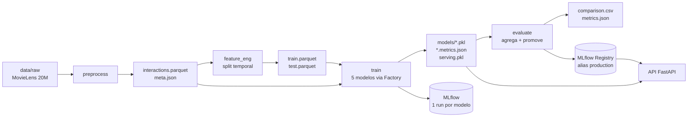

# Arquitetura

Este documento descreve a estrutura do pacote `recsys`, o fluxo do pipeline de ponta
a ponta, os design patterns aplicados e como o modelo chega ao MLflow Registry e à API.

## Visão geral

O sistema recomenda filmes a partir do comportamento de avaliação dos usuários
(MovieLens 20M). O modelo central é uma rede neural de fatoração de matrizes treinada
com BPR (Bayesian Personalized Ranking) em PyTorch, comparada a quatro baselines
scikit-learn/NumPy. Todo o fluxo é versionado com DVC, rastreado no MLflow (hospedado
no DagsHub) e servido por uma API FastAPI.

## Estrutura do pacote `src/recsys/`

| Módulo | Responsabilidade |
| ------ | ---------------- |
| `config.py` | Configuração central com Pydantic Settings. Sobrepõe `configs/config.yaml` com `.env`/variáveis de ambiente. Precedência: init > env > .env > YAML. `load_settings()` é cacheado com `lru_cache`. |
| `io.py` | Persistência de artefatos: `save_model`/`load_model` (pickle), `read_json`/`write_json` e constantes de nomes de arquivo. |
| `tracking.py` | Integração MLflow no DagsHub: `init_mlflow`, adaptador `RecommenderPyfunc`, `log_recommender` (loga e registra o modelo) e `promote_to_production`. |
| `models/` | Implementações de recomendadores (ver design patterns). |
| `preprocessing/` | `data.py` (load/filter/sample/reindex), `split.py` (Strategy de split treino/teste), `sampling.py` (Strategy de negative sampling). |
| `evaluation/metrics.py` | Métricas de regressão, ranking e diversidade, com um único passe de scoring por usuário. |
| `pipeline/` | Os 4 entrypoints do pipeline DVC: `preprocess`, `feature_eng`, `train`, `evaluate`. |
| `api/` | `serving.py` (artefato de serving + carga do modelo) e `app.py` (aplicação FastAPI). |

## Design patterns

Três padrões estruturam o código dos modelos e do pré-processamento:

- **Factory**: `models/factory.py::create_recommender` mapeia um nome
  (`global_mean`, `bias`, `svd`, `popularity`, `bpr`) para o produto concreto e levanta
  `ValueError` para nomes desconhecidos. O pipeline de treino cria todos os modelos por aqui.
- **Strategy**: `preprocessing/split.py` (`TemporalLeaveLastFraction` como padrão,
  `RandomHoldout` como controle) e `preprocessing/sampling.py`
  (`NegativeSampler` como interface, `UniformNegativeSampler` como estratégia).
- **Template Method**: `models/base.py::Recommender.evaluate` fixa o esqueleto de
  avaliação (regressão, depois ranking e diversidade), delegando `fit`/`predict` às
  subclasses. `recommend` (top-k por score) também tem implementação padrão na base.

## Fluxo do pipeline (DVC)

Definido em `dvc.yaml`, com 4 stages. Cada stage roda
`PYTHONPATH=src uv run python -m recsys.pipeline.<stage>` e depende apenas dos módulos
que importa, para não re-disparar o treino caro do BPR em edições não relacionadas.

1. **preprocess** (`pipeline/preprocess.py`, `preprocessing/data.py`): carrega
   `data/raw/rating.csv`, filtra usuários e itens com pelo menos 20 interações, amostra
   20.000 usuários (seed 42) e reindexa IDs para índices contíguos.
   Saída: `interactions.parquet` + `meta.json`.
2. **feature_eng** (`pipeline/feature_eng.py`, `preprocessing/split.py`): aplica o split
   temporal `TemporalLeaveLastFraction(0.2)`, deixando os 20% mais recentes de cada
   usuário no teste (sem vazamento de futuro). Saída: `train.parquet` + `test.parquet`.
3. **train** (`pipeline/train.py`): cria os 5 modelos via Factory, treina, avalia,
   loga uma run MLflow por modelo, salva `<nome>.pkl` + `<nome>.metrics.json` e constrói
   o `serving.pkl`.
4. **evaluate** (`pipeline/evaluate.py`): agrega as métricas por modelo em
   `comparison.csv` + `metrics.json`, escolhe o melhor RMSE e o melhor NDCG@10, loga uma
   run de resumo e chama `promote_to_production`.

Reproduzível com `dvc repro` (ou `make pipeline` para rodar os módulos direto).

## MLflow e Model Registry

- **Backend**: MLflow no DagsHub. `init_mlflow` exige `DAGSHUB_TOKEN` e falha de forma
  explícita se ausente (não há fallback local no tracking).
- **Experimento**: `MovieLens-Reco-Etapa2-Modelagem`.
- **Por modelo** (`train.py`): loga `params` (hiperparâmetros achatados, `n_users`,
  `n_items`, `seed`), `metrics` (as 10 métricas) e tags (`etapa`, `stage`, `model`,
  `dataset_version_dvc`, `ranking_protocol=full_catalog`).
- **Registro** (`tracking.py::log_recommender`): cada modelo é embrulhado em
  `RecommenderPyfunc` (um `mlflow.pyfunc.PythonModel`), logado com assinatura inferida e
  registrado como `MovieLens_<Label>_Reco` (por exemplo `MovieLens_BPR_Reco`).
- **Promoção** (`tracking.py::promote_to_production`): toda versão nova recebe o alias
  `staging`; o alias `production` só migra se o NDCG@10 da nova versão superar o da
  produção atual (ou se ainda não houver produção).

## Serving e API

Arquivos: `api/serving.py` e `api/app.py`.

- **Artefato de serving** (`build_serving_artifact`): derivado de `interactions.parquet`,
  contém `user_to_idx`, `item_ids` (índice para item cru), `seen_by_user` e `n_items`.
  Persistido em `models/serving.pkl`. A API depende apenas de `models/`, não do dataset.
- **Carga do modelo** (`load_model_prod`): tenta o Registry em
  `models:/MovieLens_BPR_Reco@production`; se creds, rede ou alias faltarem, faz fallback
  para o pickle local `models/bpr.pkl` (forçado para CPU).
- **Rotas**:
  - `GET /health`: `{"status":"ok","timestamp": "...Z"}` com headers `X-Request-ID` e
    `X-Process-Time`; retorna 503 enquanto o modelo não carregou.
  - `GET /recommend?user_id=<int>`: top-10 itens por score; 404 para `user_id`
    desconhecido, 503 se o modelo não estiver pronto.
  - `GET /docs`: Swagger UI nativo do FastAPI.
- **Middleware**: injeta `X-Request-ID` (uuid) e `X-Process-Time` em toda resposta.

Detalhes do modelo, métricas e limitações estão no [MODEL_CARD.md](MODEL_CARD.md).
